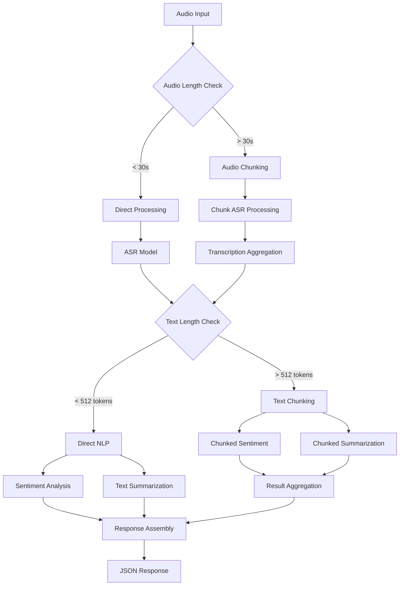

# Technical Architecture Documentation

## 🏛️ **System Architecture Overview**

### **Modular Design Pattern**
```
kiswahili-audio-pipeline/
├── main.py                     # FastAPI application entry point
├── models/                     # ML processing modules
│   ├── __init__.py
│   ├── pipeline_manager.py     # Core orchestration logic
│   └── chunking_utils.py       # Long content processing
├── schemas/                    # API data models
│   ├── __init__.py
│   └── response_models.py      # Pydantic response schemas
├── frontend/                   # Web interface
│   ├── index.html             # Main UI
│   └── static/
│       ├── app.js             # Frontend logic
│       └── style.css          # Styling
├── requirements.txt           # Python dependencies
├── setup_env.sh              # Environment setup
└── docs/                     # Documentation
    ├── DEPLOYMENT_GUIDE.md
    ├── README_TESTING.md
    └── ARCHITECTURE.md
```

## 🔄 **Processing Flow Architecture**

### **Request Processing Pipeline**


### **Component Interaction Matrix**
| Component | Dependencies | Outputs | Async |
|-----------|-------------|---------|-------|
| FastAPI Server | All modules | HTTP responses | Yes |
| Pipeline Manager | ML models, Chunking | Processing results | Yes |
| Audio Chunker | Librosa | Audio segments | No |
| Text Chunker | None | Text segments | No |
| Result Aggregator | None | Combined results | No |
| ML Models | Transformers | Predictions | Yes |

## 🧠 **Machine Learning Architecture**

### **Model Integration Strategy**
```python
class AudioProcessingPipeline:
    """
    Orchestrates three ML models in sequence:
    1. ASR: Audio → Text (Wav2Vec2)
    2. Sentiment: Text → Emotion (DistilBERT)
    3. Summary: Text → Summary (T5)
    """
    
    def __init__(self):
        self.asr_pipeline = pipeline("automatic-speech-recognition", ...)
        self.sentiment_pipeline = pipeline("text-classification", ...)
        self.summarization_pipeline = pipeline("summarization", ...)
```

### **Model Specifications**
| Model | Architecture | Parameters | Memory | Latency |
|-------|-------------|------------|---------|---------|
| ASR | Wav2Vec2-Base | 95M | ~400MB | ~2s |
| Sentiment | DistilBERT | 67M | ~250MB | ~1s |
| Summary | T5-Small | 60M | ~240MB | ~2s |
| **Total** | - | **222M** | **~900MB** | **~5s** |

## 🔧 **Chunking Algorithm Design**

### **Audio Chunking Strategy**
```python
class AudioChunker:
    """
    Implements overlapping window segmentation:
    - Window size: 30 seconds
    - Overlap: 10% (3 seconds)
    - Sampling rate: 16kHz
    """
    
    def chunk_audio(self, audio_path):
        chunk_samples = 30 * 16000  # 30s at 16kHz
        overlap_samples = 3 * 16000  # 3s overlap
        step_size = chunk_samples - overlap_samples
        
        # Sliding window implementation
        for start in range(0, len(audio), step_size):
            yield audio[start:start + chunk_samples]
```

### **Text Chunking Algorithm**
```python
class TextChunker:
    """
    Implements sentence-boundary aware chunking:
    - Max tokens: 400 (buffer for 512 limit)
    - Boundary: Sentence endings
    - Preservation: Complete sentences
    """
    
    def chunk_text(self, text):
        sentences = re.split(r'[.!?]+', text)
        chunks = []
        current_chunk = ""
        
        for sentence in sentences:
            if len(current_chunk + sentence) <= self.max_tokens:
                current_chunk += sentence
            else:
                chunks.append(current_chunk)
                current_chunk = sentence
        
        return chunks
```

## 📊 **Data Flow Architecture**

### **Input Processing**
```
Raw Audio File → Validation → Format Conversion → Length Analysis → Processing Route
```

### **Processing Routes**
```
Short Audio Path:
Audio → ASR → Text → Sentiment + Summary → Response

Long Audio Path:
Audio → Chunks → [ASR × N] → Combined Text → Text Analysis → Response

Long Text Path:
Text → Chunks → [Sentiment × N] + [Summary × N] → Aggregation → Response
```

### **Output Aggregation**
```python
class ResultAggregator:
    """
    Combines results from multiple chunks:
    - Transcriptions: Concatenation with space separation
    - Sentiments: Weighted average by confidence scores
    - Summaries: Intelligent combination with length limits
    """
```

## 🌐 **API Architecture**

### **Endpoint Design**
```python
@app.post("/process-audio")
async def process_audio(audio_file: UploadFile):
    """
    Main processing endpoint:
    - Input: Multipart form data (audio file)
    - Processing: Async pipeline execution
    - Output: JSON with transcription, sentiment, summary
    """
```

### **Response Schema Evolution**
```python
# Version 1.0 (Original)
class ProcessingResponse(BaseModel):
    transcription: str
    sentiment: Dict[str, Any]
    summary: str
    processing_time: float

# Version 2.0 (With Chunking)
class ProcessingResponse(BaseModel):
    transcription: str
    sentiment: Dict[str, Any]
    summary: str
    processing_time: float
    chunks_processed: Optional[int]  # New field
```

## 🔄 **Asynchronous Processing Design**

### **Concurrency Model**
```python
async def process_audio(self, audio_path: str):
    """
    Implements async processing with thread pool execution:
    - I/O operations: Async/await
    - ML inference: Thread pool (CPU-bound)
    - Memory management: Explicit cleanup
    """
    
    # CPU-bound operations in thread pool
    loop = asyncio.get_event_loop()
    result = await loop.run_in_executor(None, self.ml_model, data)
```

### **Resource Management**
- **Memory**: Explicit tensor cleanup after processing
- **CPU**: Thread pool for ML inference
- **I/O**: Async file operations
- **Cleanup**: Temporary file removal

## 🛡️ **Error Handling Architecture**

### **Error Propagation Strategy**
```python
try:
    # Processing pipeline
    result = await self.process_audio(audio_path)
except ModelLoadError:
    # Model initialization issues
    return {"error": "Model unavailable", "retry": True}
except ProcessingError:
    # Runtime processing issues
    return {"error": "Processing failed", "retry": False}
except ValidationError:
    # Input validation issues
    return {"error": "Invalid input", "retry": False}
```

### **Graceful Degradation**
- **ASR Failure**: Return error message, continue with manual transcription option
- **Sentiment Failure**: Return neutral sentiment, continue processing
- **Summary Failure**: Return "summarization unavailable", provide full text

## 📈 **Scalability Considerations**

### **Horizontal Scaling**
```python
# Multiple worker processes
uvicorn main:app --workers 4 --host 0.0.0.0 --port 8000

# Load balancing considerations
- Stateless design enables load balancing
- Model loading per worker (memory trade-off)
- Shared model cache (future optimization)
```

### **Performance Optimization**
- **Model Caching**: Keep models in memory between requests
- **Batch Processing**: Process multiple chunks simultaneously
- **GPU Acceleration**: Optional CUDA support for faster inference
- **Result Caching**: Cache results for identical inputs (future feature)

## 🔍 **Monitoring Architecture**

### **Logging Strategy**
```python
import logging

# Structured logging
logger = logging.getLogger(__name__)

# Log levels by component
- DEBUG: Detailed processing steps
- INFO: Processing milestones
- WARNING: Performance issues
- ERROR: Processing failures
- CRITICAL: System failures
```

### **Metrics Collection**
```python
# Performance metrics
processing_time_histogram
memory_usage_gauge
request_count_counter
error_rate_counter

# Business metrics
audio_length_distribution
chunk_count_distribution
model_accuracy_scores
```

## 🔧 **Configuration Management**

### **Environment Configuration**
```python
# Configuration hierarchy
1. Environment variables (highest priority)
2. Configuration files
3. Default values (lowest priority)

# Key configurations
MODEL_CACHE_DIR = os.getenv("MODEL_CACHE_DIR", "~/.cache/huggingface")
CHUNK_DURATION = int(os.getenv("CHUNK_DURATION", "30"))
MAX_TOKENS = int(os.getenv("MAX_TOKENS", "400"))
```

### **Model Configuration**
```python
# Model parameters
ASR_MODEL = "RareElf/swahili-wav2vec2-asr"
SENTIMENT_MODEL = "lxyuan/distilbert-base-multilingual-cased-sentiments-student"
SUMMARY_MODEL = "google-t5/t5-small"

# Processing parameters
AUDIO_SAMPLE_RATE = 16000
TEXT_MIN_LENGTH = 10  # words
SUMMARY_MAX_LENGTH = 100  # tokens
```

## 🚀 **Deployment Architecture**

### **Container Strategy** (Future)
```dockerfile
FROM python:3.9-slim

# System dependencies
RUN apt-get update && apt-get install -y \
    libsndfile1 \
    ffmpeg \
    && rm -rf /var/lib/apt/lists/*

# Python dependencies
COPY requirements.txt .
RUN pip install -r requirements.txt

# Application code
COPY . /app
WORKDIR /app

# Model pre-download (optional)
RUN python -c "from models.pipeline_manager import AudioProcessingPipeline; AudioProcessingPipeline()"

EXPOSE 8000
CMD ["uvicorn", "main:app", "--host", "0.0.0.0", "--port", "8000"]
```

### **Infrastructure Requirements**
- **Compute**: 2-4 CPU cores, 8GB RAM minimum
- **Storage**: 10GB for models and temporary files
- **Network**: Internet access for initial model download
- **OS**: Linux/macOS/Windows compatibility

---

**Architecture Version**: 2.0  
**Last Updated**: [Current Date]  
**Complexity**: Research Grade  
**Maintainability**: High (Modular Design)